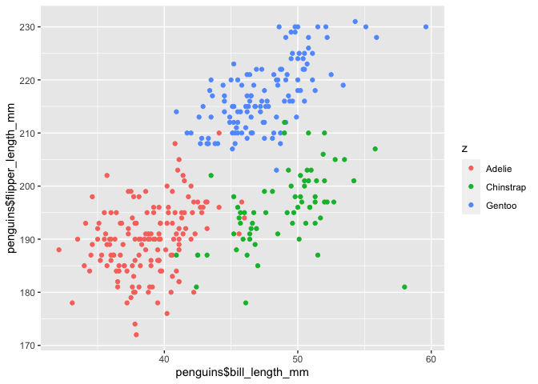

p8105_hw1_tw2838
================
Tianyou Wang
2022-09-24

# **Problem \#1**

## Load and Describe the Penguins Dataset

Now, we are loading the `penguins` dataset

``` r
data("penguins", package = "palmerpenguins")
```

In the `penguins` dataset, we have characteristic variables, including
species, island, and sex. The numeric variables include bill lenghs in
millmeters, bill depth in millmeters, flipper length in millmeters, body
mass in grams, and year.

This data set include 344 rows and 8 columns.

To get the mean flipper length, I excluded the missing values and
rounded up to 2 decimal place. The mean flipper length is 200.92 mm.

## Scatterplot of Flipper_length vs Bill_length

``` r
library(tidyverse)
```

    ## ── Attaching packages ─────────────────────────────────────── tidyverse 1.3.2 ──
    ## ✔ ggplot2 3.3.6      ✔ purrr   0.3.4 
    ## ✔ tibble  3.1.8      ✔ dplyr   1.0.10
    ## ✔ tidyr   1.2.0      ✔ stringr 1.4.1 
    ## ✔ readr   2.1.2      ✔ forcats 0.5.2 
    ## ── Conflicts ────────────────────────────────────────── tidyverse_conflicts() ──
    ## ✖ dplyr::filter() masks stats::filter()
    ## ✖ dplyr::lag()    masks stats::lag()

``` r
dfQ1 = tibble(
  x = penguins$bill_length_mm,
  y = penguins$flipper_length_mm,
  z = penguins$species
  )

ggplot(dfQ1, aes(x = penguins$bill_length_mm , y = penguins$flipper_length_mm, color = z) ) +  geom_point()
```

<!-- -->

Save the scatter plot into the local R project file.

``` r
ggsave("scatter_plot_penguins.pdf", height = 4, width = 6)
```

# **Problem \#2**

## Create the Data Frame

``` r
dfQ2 = tibble(
  var_random = rnorm(10),
  var_logic = var_random > 0,
  var_char = c ("A","A","A","B","B","B","C","C","C","C" ),
  var_fac = factor(c("high","high","high","medium","medium","medium","low","low","low","low"))
)
print(dfQ2)
```

    ## # A tibble: 10 × 4
    ##    var_random var_logic var_char var_fac
    ##         <dbl> <lgl>     <chr>    <fct>  
    ##  1      1.38  TRUE      A        high   
    ##  2      0.601 TRUE      A        high   
    ##  3      1.41  TRUE      A        high   
    ##  4      1.26  TRUE      B        medium 
    ##  5      0.309 TRUE      B        medium 
    ##  6      1.83  TRUE      B        medium 
    ##  7     -0.921 FALSE     C        low    
    ##  8     -0.604 FALSE     C        low    
    ##  9     -0.359 FALSE     C        low    
    ## 10     -1.31  FALSE     C        low

## Mean for Each Variables

``` r
mean(dfQ2$var_random)
```

    ## [1] 0.3595198

We get the mean for the random variable since it is a numeric variable.
The mean is 0.3595198.

``` r
mean(dfQ2$var_logic)
```

    ## [1] 0.6

We get the mean for the logic variable since the true is treated at “1”
and the false is treated as “0.” The mean is 0.6.

``` r
mean(dfQ2$var_char)
```

    ## [1] NA

``` r
mean(dfQ2$var_fac)
```

    ## [1] NA

We don’t have means for the character and factor variables since they
are not numerical or factorial.

## Convert to Numeric Variables

``` r
as.numeric(dfQ2$var_logic)
```

R assigned “1” for “TRUE” and “0” for FAlSE.”

``` r
as.numeric(dfQ2$var_char)
```

R failed to assign numeric values for the character variable. The
Warning showed that NAs were introduced by coercion.

``` r
as.numeric(dfQ2$var_fac)
```

R successfully assigned numeric value for each levels.
